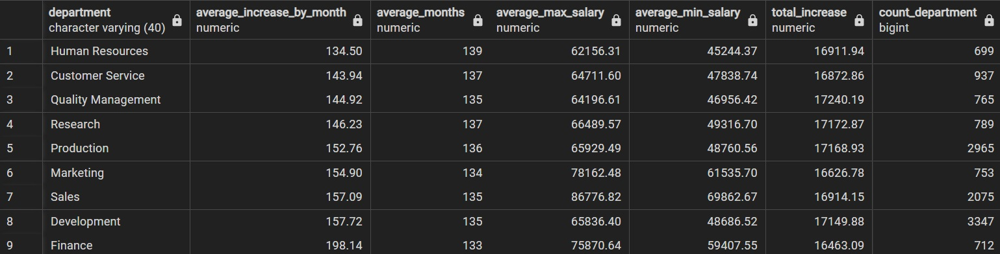
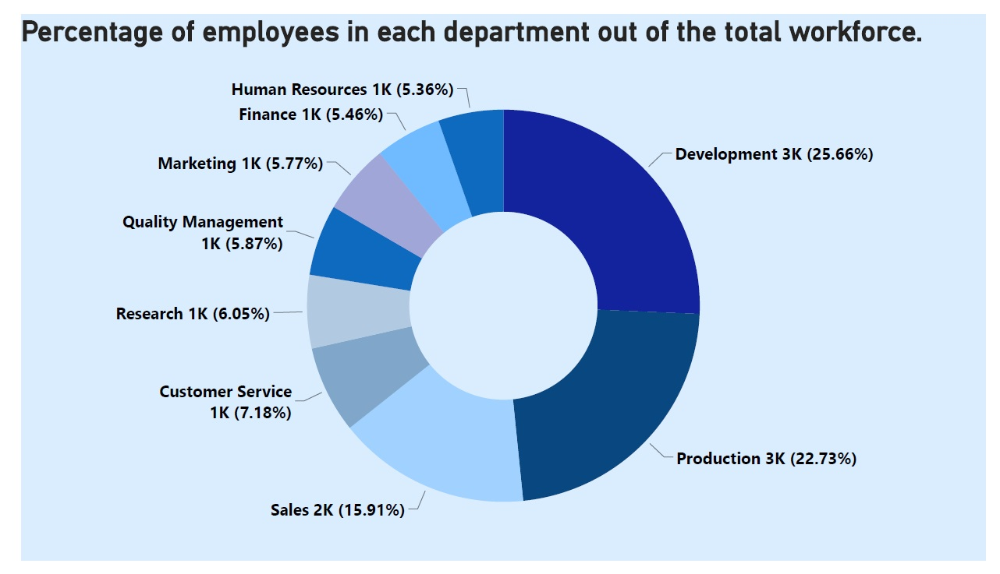
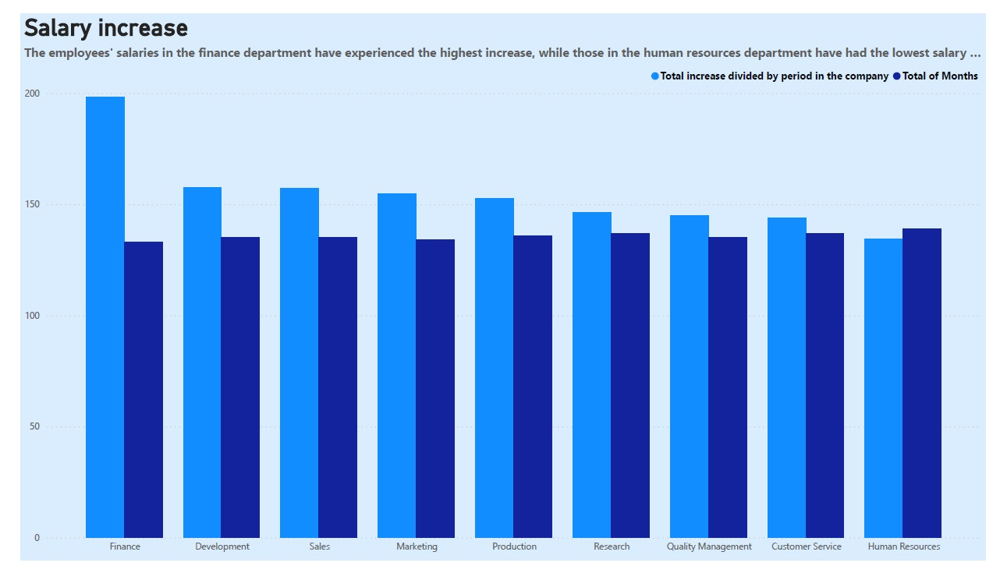
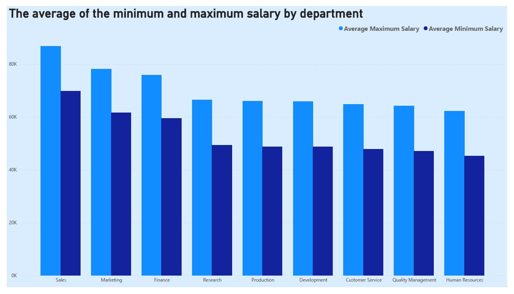
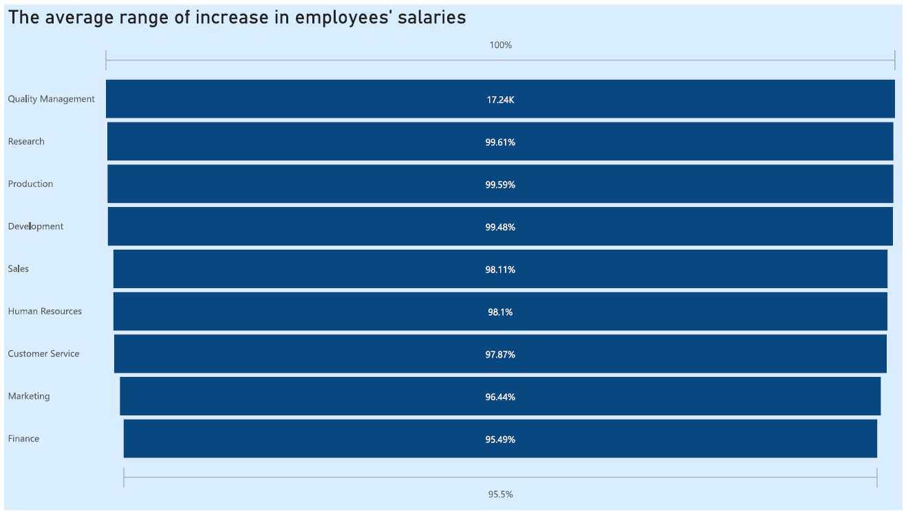

# Employees Salaries Analysis

## Introduction 
### This project showcases my skills in data preprocessing, data cleaning, data preparation, storytelling and visualization. I will use specially SQL during the process and Power BI to finally present the results.

## Project
### For this project, I will utilize fabricated business data comprising tables such as 'employees,' 'salaries,' 'dept_emp,' and 'department.' My objective is to create visualizations that illustrate and compare salary discrepancies and increments across various departments, aiming to comprehend employee satisfaction.

## Data exploration 
### I executed several fundamental queries to grasp the data and initiate the process of linking/connecting the tables.
``` SQL
select *
from employees
--The primary key of this table is emp_no

select *
from salaries
--The primary key of this table is emp_no.

select *
from dept_emp
--The primary key of this table is dept_no and there is a foreign key which is emp_no.

select *
from departments
-- The primary key of this table dept_no.
```
* ### The dept_emp table's query showed that the the '9999-01-01'. This inexistant date represents the current date. For the purpose of the project, I will change it to '2003-01-01' as if it was the current date. 
``` SQL
select *
from dept_emp

--Get the highest date before '9999-01-01'.
-- result: 2002-08-01.
select max(to_date)
from dept_emp
where to_date != '9999-01-01'

--Update the date to what would be the current date approximately. 
update dept_emp
set to_date ='2003-01-01'
where to_date = '9999-01-01'
```

## Data Preparation
### This query create another table with the following features:
* #### Average_increase_months:
  * This column shows the salary's increase average by department.
* #### average__months:
  * This column shows the average amount of months that takes to get the higher salary by department.
* #### average_max_salary:
  * This column shows the average of the highest salary by department.
* #### total_increase:
  * This column shows the range of the salary's increase by department.
* #### average_min_salary:
  * This column shows the average of the lowest salary by department.
``` SQL

-- The next line creates a table that I used to create the visualizations on Power BI
create view employees_statistics as(

-- The next CTE (Common Table expression) joins the tables employees, department, salaries and dept_emp and returns the full_name, max_salary, mix_salary, deparment and the period from the moment that the employee is hired till the last salary's increase date.
with summary_table as (
select 
	concat(e.first_name,' ',e.last_name) as full_name,
	EXTRACT(YEAR FROM AGE(de.to_date::date, e.hire_date::date)) * 12 +
       EXTRACT(MONTH FROM AGE(de.to_date::date, e.hire_date::date)) AS period_in_months,
	max(s.salary) as max_salary,
	min(s.salary) as min_salary,
	d.dept_name as department
	
	from employees e
	join salaries s
	on e.emp_no = s.emp_no
	join dept_emp de
	on de.emp_no = e.emp_no
	join departments d
	on de.dept_no = d.dept_no

	group by e.first_name, e.last_name, e.hire_date, de.to_date, d.dept_name
	order by max_salary, min_salary desc
	)

-- This query gives me the averages and the count_department column that I used in the visualization.
select 
	department, 
	round(avg(increase_by_month),2) as average_increase_by_month,
	round(avg(period_in_months)) as average_increase_months,
	round(avg(max_salary),2) as average_max_salary,
	round(avg(min_salary),2) as average_min_salary,
	round(avg(max_salary-min_salary),2) as total_increase,
	count(department) as count_department
	

from 

-- In this subquery, I preprocess the features that I used in the visualization, it gives me the increase_by_month column that I will use for the average increase by month column.
(select 
	full_name,
		case
			when period_in_months < 1 then 1
			else
				round(((max_salary-min_salary)/period_in_months),2) end as increase_by_month,
	max_salary, 
	min_salary, 
	department, 
	period_in_months
	
from summary_table
group by full_name, max_salary,min_salary, period_in_months, department)
	group by department
	order by average_increase_by_month, average_max_salary, average_min_salary desc)
```
### The aforementioned query yields the following result. The data has been cleaned, processed, and trimmed down to include only the information necessary for the visualization.


## Visualization

### The graph below displays the distribution of employees by department. It's evident that the Development and Production departments collectively represent approximately 50% of the company. 


### The following graph displays a bar chart featuring two columns. The first column illustrates the salary difference from the point of an employee's hiring to their most recent salary increase, represented by the average within each department. In the second column, it showcases the duration taken to attain these raises, represented by the total number of months.


### We can observe that the highest initial and final salaries occur sequentially in the Sales, Marketing, and Finance departments.

### In conclusion, the Quality Management department achieves the highest salary increase, while the Finance department attains the lowest increase.


## Conclusion
### While the finance department experiences a quicker rate of salary increase compared to other departments, the employees' salaries within it won't reach the levels seen in the sales and marketing departments. Although the quality management department observes the highest range of salary increases, it's important to note that their salaries will neither be the highest nor will they reach them as fast as the finance department.